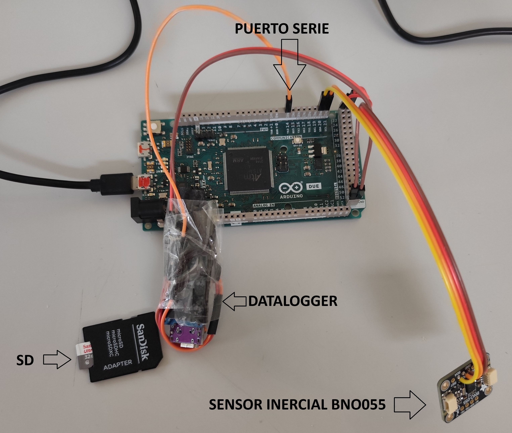

# Arduino Serial Logger Example

## Descripción
Este proyecto implementa una comunicación en Simulink para adquirir datos del sensor BNO055 conectado a un Arduino DUE. La frecuencia de muestreo es de 100 Hz, y los datos adquiridos se envían a través del puerto serie en un formato de trama estructurado. La intención es que esta información pueda ser almacenada en un datalogger para su posterior análisis.

## Componentes Utilizados
- **Arduino DUE**
- **Sensor BNO055** (Acelerómetro, Giroscopio y Magnetómetro)
- **Simulink** (MATLAB)

## Configuración del Proyecto
Para garantizar el correcto funcionamiento del proyecto, es necesario configurar los siguientes parámetros en Simulink:

### Configuración del Puerto Serie
- **Baud Rate:** 115200 bps
- **Formato de salida:** ASCII

### Configuración en Simulink
- **Frecuencia de muestreo:** 100 Hz
- **Formato de trama:** `"A,%.3f,%.2f,%.2f,%.2f,%.2f,%.2f,%.2f,%.2f,%.2f,Z\n"`

### Simulink: Configuración en Code Generation
- **Language Standard:** C99

## Estructura del Proyecto en Simulink
1. **Adquisición de datos**: Se obtienen datos del sensor BNO055 conectados a Arduino DUE.
2. **Selección y procesamiento**: Se extraen los valores deseados y se convierten a formato `single`.
3. **Composición de la trama**: Los datos se estructuran en un formato de cadena de texto con separadores adecuados.
4. **Conversión a ASCII**: Se convierte la cadena a formato ASCII para su transmisión.
5. **Envío por puerto serie**: Se transmite la información a 115200 bps para su almacenamiento en un datalogger.

## Script para la limpieza de tramas: Procesar_tramas.m
Además del proceso de adquisición de datos del sensor BNO055, este proyecto incluye una función en MATLAB para limpiar las tramas recibidas desde el Arduino DUE. Esta función permite filtrar las tramas válidas de un archivo de entrada, eliminando aquellas que no cumplen con el formato adecuado, y guardando las tramas válidas en un archivo de salida en formato CSV.

### Uso de la Función
Para utilizar esta función, solo necesitas especificar los nombres del archivo de entrada y del archivo de salida:

```matlab
a = "DATA_6.TXT";  % Archivo de entrada con las tramas
b = "datos_6.csv"; % Archivo de salida con las tramas limpias
limpiar_tramas(a, b);
```
### Descripción de la Función limpiar_tramas
La función limpiar_tramas realiza los siguientes pasos:

- Lectura del archivo de entrada: El archivo que contiene las tramas se abre y se lee completamente como una cadena de texto.

- Filtrado de tramas válidas: Utiliza una expresión regular para detectar las tramas que coinciden con el formato esperado (incluyendo los valores del sensor BNO055 y delimitadas por "A" al inicio y "Z" al final).

- Escritura de las tramas válidas: Las tramas que coinciden con el patrón se guardan en el archivo de salida, una por línea.

- Mensaje de confirmación: Al finalizar el proceso, muestra cuántas tramas válidas fueron procesadas y almacenadas.

## Notas Adicionales
- Asegurarse de que el Arduino DUE esté correctamente conectado y reconocido por Simulink.
- Es recomendable validar la estructura de la trama en el datalogger para garantizar la correcta recepción de datos.

## Montaje



En esta imagen se muestra un esquema de montaje sencillo empleado en el ejemplo y con el cuál se ha obtenido el fichero para procesar.

## Licencia
Este proyecto es de libre uso para propósitos educativos y de investigación. Creado por racarla96 (@racarla96), disponible en [https://github.com/racarla96/Arduino_Serial_Logger_Example](https://github.com/racarla96/Arduino_Serial_Logger_Example).

